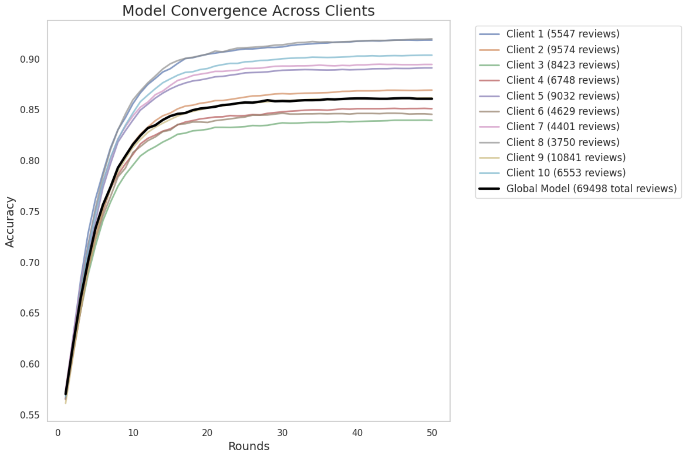

# SecureShare: Federated Learning for Sentiment Analysis

SecureShare demonstrates the implementation of federated learning for sentiment analysis. Federated learning is a machine learning technique that trains an algorithm across multiple decentralized edge devices or servers holding local data samples without exchanging them. This approach addresses critical issues in traditional centralized machine learning, such as data privacy, security, access rights, and access to heterogeneous data.



SecureShare showcases:
1. Privacy preservation through local data processing
2. Performance comparison between centralized and federated learning
3. Communication efficiency in federated settings
4. Model convergence across multiple clients
5. Handling of data heterogeneity

By leveraging federated learning, SecureShare achieves comparable performance to centralized learning while maintaining data privacy and adapting to non-uniform data distributions across clients.

## Table of Contents

- [Installation](#installation)
- [Usage](#usage)
- [Features](#features)
- [Results](#results)
- [Contributing](#contributing)
- [License](#license)

## Installation

To set up SecureShare, follow these steps:

1. Clone the repository:
```
git clone https://github.com/yourusername/SecureShare.git
```
2. Navigate to the project directory:
```
cd SecureShare
```
3. Install the required dependencies:

```
pip install -r requirements.txt
```

4. Run the main script:

```
python secureshare.py
```
## Features

1. **Federated Learning Implementation**: Custom implementation of federated learning algorithm using scikit-learn's LogisticRegression as the base model.

2. **Non-uniform Data Distribution**: Simulates realistic scenarios where data is not uniformly distributed among clients.

3. **Dynamic Learning Rate**: Implements learning rate decay to improve convergence.

4. **Performance Metrics**: Tracks accuracy, F1 score, precision, and recall for comprehensive evaluation.

5. **Centralized vs. Federated Comparison**: Compares the performance of federated learning against a centralized model.

6. **Visualizations**: Generates insightful visualizations to demonstrate various aspects of federated learning.

## Results

SecureShare illustrate key aspects of federated learning:

1. **Privacy Preservation**: Demonstrates how data is distributed among clients, showing each client stores its data locally.

2. **Performance Comparison**: Compares the accuracy of federated learning with centralized learning across different numbers of clients.

3. **Communication Efficiency**: Shows how model accuracy improves over communication rounds for varying numbers of clients.

4. **Model Convergence**: Illustrates how individual client models and the global model converge over training rounds.

5. **Data Heterogeneity**: Visualizes the non-uniform distribution of data classes across clients.

These results highlight the effectiveness of SecureShare in maintaining privacy while achieving performance comparable to that of centralized learning.

## Contributing

Contributions to SecureShare are welcome! Please follow these steps:

1. Fork the repository
2. Create a new branch: `git checkout -b feature-branch-name`
3. Make your changes and commit them: `git commit -m 'Add some feature'`
4. Push to the branch: `git push origin feature-branch-name`
5. Submit a pull request

For major changes, please open an issue first to talk about what you'd like to change.

## License

SecureShare is licensed under the Apache License.


